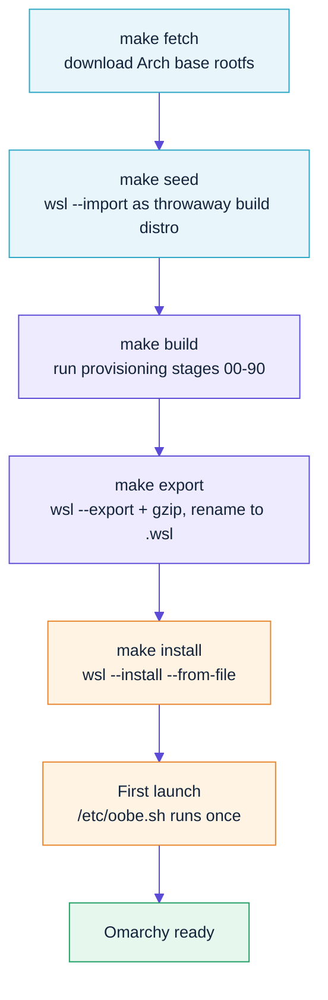
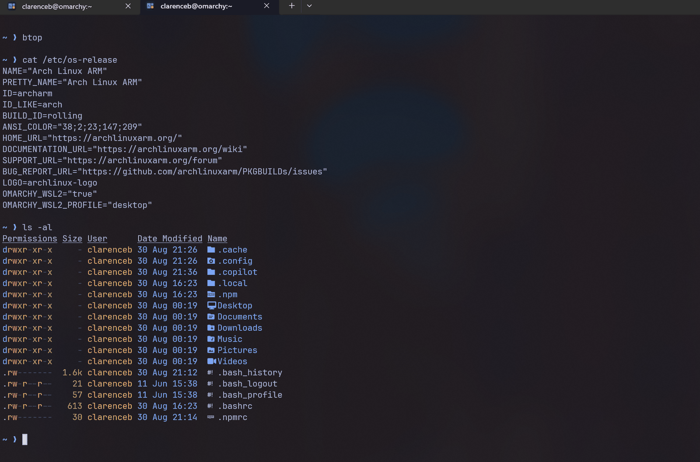
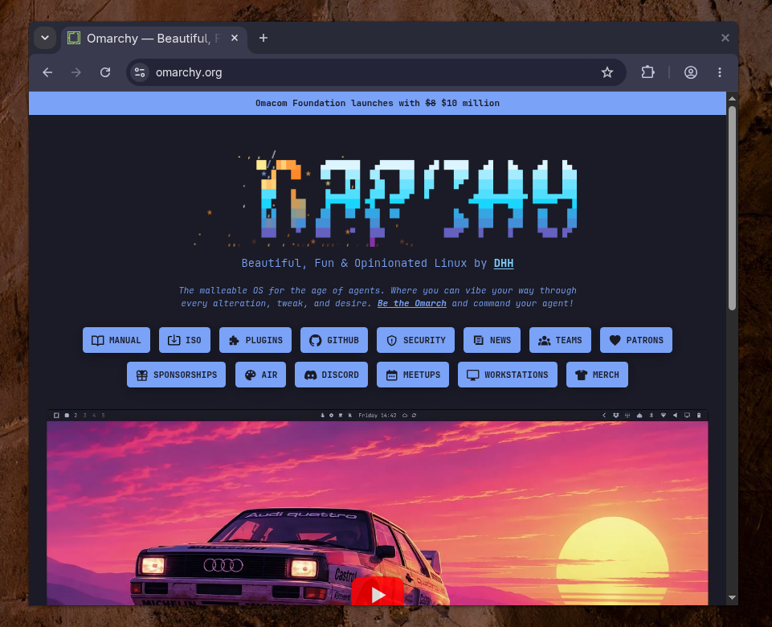
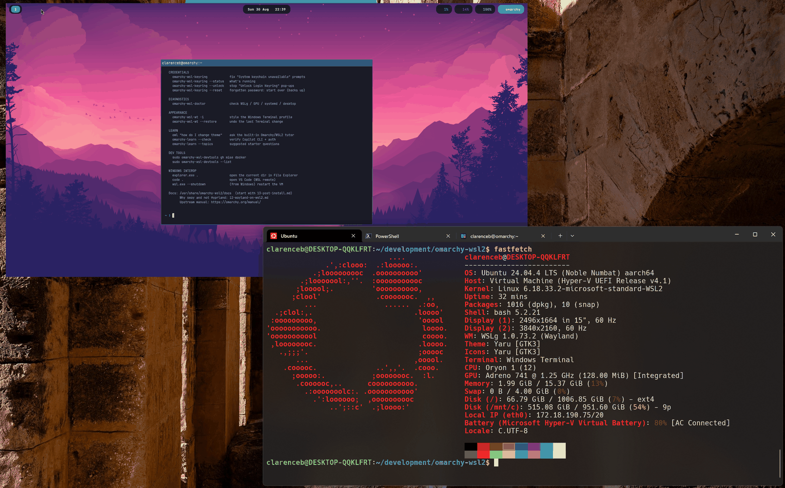
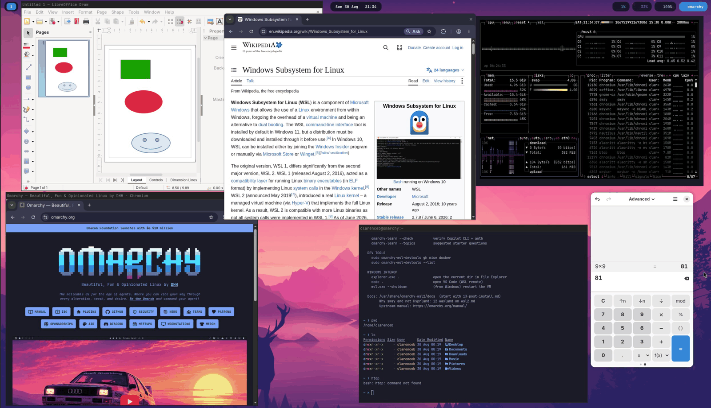
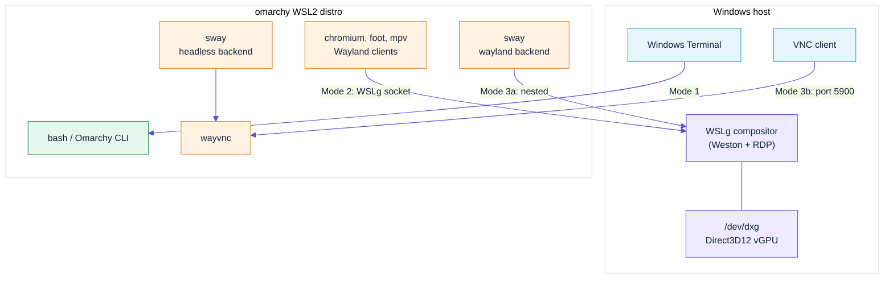

<div align="center">


**Run [Omarchy](https://omarchy.org) — the Arch + Hyprland "omakase" Linux distribution — as a first-class WSL2 distro on Windows.**

[](LICENSE)
[](https://learn.microsoft.com/windows/wsl/)
[](https://archlinux.org/)

</div>

---

## What this is

Omarchy has no official WSL support. Its installer hard-requires bare-metal
Arch with a Limine bootloader and a Btrfs root filesystem, and its desktop
assumes a real GPU it can take over.

This repo builds an **installable `.wsl` image** that gives you Omarchy's
actual tooling, dotfiles and themes on WSL2, in three usable modes:

| Mode | What you get | Status |
|---|---|---|
| **1. Headless** | Full Omarchy CLI/TUI: Neovim, lazygit, btop, fzf, starship, themes | ✅ Works well |
| **2. WSLg apps** | Individual GUI apps as ordinary Windows windows | ✅ Works well |
| **3. Full desktop** | A tiling **sway** session with Omarchy's keys and theming — nested in a window, or over VNC | ✅ Works |

> **Honest expectations.** Mode 3 is not Hyprland, because **Hyprland cannot
> run on WSL2 at all**. Its backend (Aquamarine) requires a GBM allocator
> built from a DRM node, and WSL2 exposes no DRM device — only `/dev/dxg`.
> WSLg also doesn't advertise `zwp_linux_dmabuf_v1`, so nesting fails too
> ([hyprwm/Hyprland#3479](https://github.com/hyprwm/Hyprland/issues/3479),
> where the maintainer's full reply was "no").
>
> wlroots *can* run here — it falls back to shared-memory buffers needing no
> DRM node — so we ship **sway** configured with Omarchy's keybindings, gaps
> and theme system.
>
> **The trade-offs:** rendering is on the **CPU** (`pixman`), so terminals and
> editors are fine but video and WebGL are not; there are **no animations,
> blur or rounded corners**; **no Xwayland** inside the session; and a
> **single output** only. You keep the entire Omarchy CLI, themes, app suite,
> waybar and clipboard integration. Full detail, including a `vkms` experiment
> that got Hyprland *almost* working, is in
> **[docs/12-wayland-on-wsl2.md](docs/12-wayland-on-wsl2.md)**.
>
> Windows can **tile** (Omarchy's model, and DHH's firm view on where your
> hands belong) or **float** with titlebars if you would like to use the mouse
> like a normal person — the wizard asks, and `omarchy-wsl-desktop --floating`
> switches any time.
> If you want Hyprland itself on Windows, use a Hyper-V VM.

---

## Quick start

> **You do not need PowerShell.** The whole build runs from inside an existing
> WSL2 distro — Ubuntu is perfect. It drives Windows through `wsl.exe` interop.
> (If you'd rather start from Windows, use `windows\omarchy-wsl2.ps1`.)

```bash
# From your existing Ubuntu (or any) WSL2 distro
git clone https://github.com/clarenceb/omarchy-wsl2.git
cd omarchy-wsl2

./omarchy-wsl2        # guided wizard - checks prerequisites, then builds
```

The wizard walks you through everything:

```
   ╭────────────────────────────╮
   │  ┌───────────┬────────┐    │
   │  │           │        │    │   omarchy-wsl2
   │  │    >_     ├────────┤    │   Omarchy, as a WSL2 distribution
   │  │           │        │    │
   │  └───────────┴────────┘    │
   ╰────────────────────────────╯

    1) Check prerequisites  Verify the host and offer to install what's missing
    2) Build & install      Create a new Omarchy WSL2 distro from scratch
    3) Modify existing      Change theme, add tools or tiers, update
    4) Set up omarchy-learn AI tutor for Omarchy & WSL2 questions
    5) Diagnostics          Check WSLg, GPU, systemd and desktop readiness
    6) Windows extras       Nerd Font, Windows Terminal, VS Code
    7) Documentation        Where to read more
    8) Uninstall            Remove the distro
```

It is **re-runnable** — run it again any time to change theme, add the desktop
tier, install dev tools, or rebuild.

When you pick the **Full desktop** profile, the wizard also asks how you want
it to behave:

| Question | Options |
|---|---|
| **How should windows behave?** | **Tiling** — auto-arranged, no titlebars, Omarchy's model · **Floating** — draggable windows with titlebars, like Windows or GNOME |
| **How should the desktop be displayed?** | **In a window** — nested in WSLg · **Full screen (VNC)** — a virtual display over VNC |
| **Full-screen resolution?** | Your detected Windows resolution, 1920x1080, 2560x1440, or a custom size |

Both are changeable later without a rebuild:

```bash
omarchy-wsl-desktop --floating          # or --tiling
omarchy-wsl-desktop vnc --size 2560x1440
```

### Prefer the Makefile?

```bash
make check          # verify WSL >= 2.4.4, architecture, host tooling
make all            # fetch -> seed -> build -> export  (30-60 min)
make install        # register it with Windows

wsl -d omarchy      # you're in
```

Build a lighter image if you only want the terminal:

```bash
make all PROFILE=headless
```

Or bake the floating layout into the image:

```bash
make all PROFILE=desktop OMARCHY_LAYOUT=floating
```

---

## Learn as you go: `omarchy-learn`


New to Arch or Hyprland? The image ships an AI tutor that answers questions
grounded in the Omarchy source and this project's docs.

```bash
oml "how do I list the packages I have installed"
oml "why can't I run the full Hyprland desktop"
oml "I'm used to apt, what do I need to know"
```

It uses the GitHub Copilot CLI on the `auto` model (cheapest), remembers your
preferences, renders answers with `glow`, and is strictly read-only — it shows
you commands, it never runs them.

Set it up from the wizard (option 4), or see
**[docs/11-omarchy-learn.md](docs/11-omarchy-learn.md)** for manual install.

---

## How the build works



The provisioning stages, in order:

```mermaid
%%{init: {'theme':'base','themeVariables':{'primaryColor':'#E8F6FB','primaryTextColor':'#13233A','primaryBorderColor':'#2AA6C4','lineColor':'#5B4BD6','fontSize':'14px'}}}%%
flowchart LR
    S0["00-pacman<br/>keyring, mirrors,<br/>disable sandbox"] --> S1["10-base<br/>CLI/TUI tier"]
    S1 --> S2["20-omarchy<br/>vendor bin/ config/<br/>themes/ + repo"]
    S2 --> S3["30-apps<br/>WSLg GUI tier"]
    S3 --> S4["40-desktop<br/>sway desktop tier"]
    S4 --> S5["50-user<br/>uid 1000 + sudo"]
    S5 --> S6["60-wsl<br/>wsl.conf, OOBE,<br/>icon, helpers"]
    S6 --> S7["70-theme<br/>headless theming"]
    S7 --> S8["90-cleanup<br/>shrink + verify rules"]

    style S0 fill:#E8F6FB,stroke:#2AA6C4,color:#13233A
    style S1 fill:#E8F6FB,stroke:#2AA6C4,color:#13233A
    style S2 fill:#EFEBFF,stroke:#5B4BD6,color:#13233A
    style S3 fill:#EFEBFF,stroke:#5B4BD6,color:#13233A
    style S4 fill:#EFEBFF,stroke:#5B4BD6,color:#13233A
    style S5 fill:#FFF3E4,stroke:#E8842B,color:#13233A
    style S6 fill:#FFF3E4,stroke:#E8842B,color:#13233A
    style S7 fill:#FFF3E4,stroke:#E8842B,color:#13233A
    style S8 fill:#E6F7EE,stroke:#1E9E63,color:#13233A
```



---

## The three modes

<div align="center">

<!-- Screenshots: see assets/screenshots/README.md for capture and naming
     guidance. Delete any row below that you have not captured yet - a broken
     image is worse than no image. -->

| Mode 1 — headless | Mode 2 — WSLg apps |
|:---:|:---:|
|  |  |
| Omarchy's terminal environment in Windows Terminal | Individual GUI apps, indistinguishable from native |

| Mode 3a — nested | Mode 3b — VNC |
|:---:|:---:|
|  |  |
| The tiling desktop in a window, beside your Windows apps | Full screen over VNC — the recommended mode |

</div>



```bash
# Mode 1 - headless
wsl -d omarchy

# Mode 2 - one GUI app at a time, through WSLg
omarchy-wsl-app chromium

# Mode 3a - nested tiling desktop (a single window on your Windows desktop)
omarchy-wsl-desktop

# Mode 3b - headless desktop + VNC (resizable, full-screen capable)
omarchy-wsl-desktop vnc --size 2560x1440
#   then connect a Windows VNC client to 127.0.0.1:5900
```

Full detail, including which Omarchy features do and don't survive:
**[docs/03-modes.md](docs/03-modes.md)**. Why it's sway and not Hyprland:
**[docs/12-wayland-on-wsl2.md](docs/12-wayland-on-wsl2.md)**.

---

## Architecture support

| Host | Base image | Omarchy pacman repo | Verdict |
|---|---|---|---|
| **x86_64** | Official [Arch Linux WSL image](https://geo.mirror.pkgbuild.com/wsl/latest/) | ✅ 200+ packages | Fully supported |
| **aarch64** (Windows on ARM) | [Arch Linux ARM](https://archlinuxarm.org) | ⚠️ 1 package (keyring only) | Works, with substitutions |

**ARM64 is genuinely viable.** Arch Linux ARM ships `sway`, `waybar`,
`wayvnc`, `foot` and `seatd` for aarch64, so the desktop tier builds. What you
lose is Omarchy's own x86_64-only repo — `walker`, `elephant`, `omarchy-nvim`,
`omacalc` and friends. The build substitutes equivalents and logs anything it
couldn't install. Upstream's installer also hard-blocks non-x86_64
(`guard.sh:26-28`), which is one more reason we don't run it.

Note that the desktop tier is CPU-rendered (`pixman`) on **every**
architecture, not just ARM — see
[docs/12-wayland-on-wsl2.md](docs/12-wayland-on-wsl2.md).

See **[docs/08-arm64.md](docs/08-arm64.md)** for the substitution table and
instructions for building the missing packages from source.

---

## Documentation

| Doc | Contents |
|---|---|
| [01-architecture.md](docs/01-architecture.md) | Why the upstream installer can't run, and what we do instead |
| [02-build.md](docs/02-build.md) | Every Makefile target, tarball prep, distro registration |
| [03-modes.md](docs/03-modes.md) | Headless, WSLg apps, and the full desktop — in depth |
| [04-getting-started.md](docs/04-getting-started.md) | First 30 minutes: keybindings, config, files |
| [05-theming.md](docs/05-theming.md) | Omarchy themes, plus Windows Terminal + VS Code |
| [06-dev-tools.md](docs/06-dev-tools.md) | VS Code, GitHub Copilot CLI, mise, Docker, Git |
| [07-ubuntu-users.md](docs/07-ubuntu-users.md) | **Coming from Ubuntu? Start here.** apt→pacman, concepts |
| [08-arm64.md](docs/08-arm64.md) | Windows on ARM: what works, what to compile |
| [09-troubleshooting.md](docs/09-troubleshooting.md) | Known failures and their fixes |
| [10-reference.md](docs/10-reference.md) | Env vars, file layout, upstream sources |
| [11-omarchy-learn.md](docs/11-omarchy-learn.md) | The built-in AI tutor: install, usage, memory |
| [12-wayland-on-wsl2.md](docs/12-wayland-on-wsl2.md) | **Why Hyprland can't run on WSL2**, and what does |
| [13-post-install.md](docs/13-post-install.md) | **Start here after installing.** Every helper, the wizard, sane defaults |

---

## Requirements

- Windows 10 22H2 / Windows 11, **WSL ≥ 2.4.4** (`wsl --version`, `wsl --update`)
- An existing WSL2 distro to build from — **Ubuntu is fine**
- ~15 GB free disk for a `desktop` build (~4 GB for `headless`)
- `curl`, `tar`, `gzip`, `make`, `git`, `python3` on the build host

**On Windows, for the intended look:**

- **Windows Terminal** — `winget install Microsoft.WindowsTerminal`
- **A Nerd Font** — `winget install --id DEVCOM.JetBrainsMonoNerdFont`

  The font must be installed on **Windows**, not inside the distro: Windows
  Terminal renders with Windows fonts. Without one, Omarchy's prompt and `eza`
  icons appear as `` boxes.

  > Careful: `SourceFoundry.HackFonts` installs **plain Hack**, which has *no*
  > Nerd Font glyphs. Nerd Font variants are named `... Nerd Font`. For Hack
  > specifically, download it from
  > [nerdfonts.com](https://www.nerdfonts.com/font-downloads).

`./omarchy-wsl2` → option 1 checks all of this and offers to install whatever
is missing, including the optional Windows-side extras via `winget`.

### Do I need PowerShell?

**No.** Everything runs from bash inside an existing WSL2 distro; `wsl.exe`
interop does the Windows-side work. PowerShell is only needed for two optional
things:

| Task | Script |
|---|---|
| Launch the wizard from Windows instead of WSL | `windows\omarchy-wsl2.ps1` |
| Publish your image in `wsl --list --online` | `windows\Override-Manifest.ps1` (elevated) |

---

## Prior art and credits

This project stands on other people's work — check theirs too:

- **[basecamp/omarchy](https://github.com/basecamp/omarchy)** — Omarchy itself, by DHH and contributors
- **[craigloewen-msft/Omarchy-wsl](https://github.com/craigloewen-msft/Omarchy-wsl)** — by Microsoft's WSL PM; uses the `wslc` container tooling
- **[taufderl/omarchy-wsl](https://github.com/taufderl/omarchy-wsl)** — pacstraps the real `omarchy` package and runs upstream's install scripts
- **[hypn/omarchy-for-wsl](https://github.com/hypn/omarchy-for-wsl)** — the original fork-based approach

How this repo differs: it vendors Omarchy's assets rather than running (or
forking) the guarded installer, treats headless / WSLg / desktop as three
first-class supported modes, and builds on **both x86_64 and aarch64** using
only `wsl.exe` — no Docker, Podman or `wslc` required.

---

## Licence

MIT — see [LICENSE](LICENSE).

Unofficial and not affiliated with Basecamp, 37signals or the Omarchy
maintainers. The `omarchy-wsl2` logo in `assets/` is an original work and does
not reproduce the Omarchy logo.
