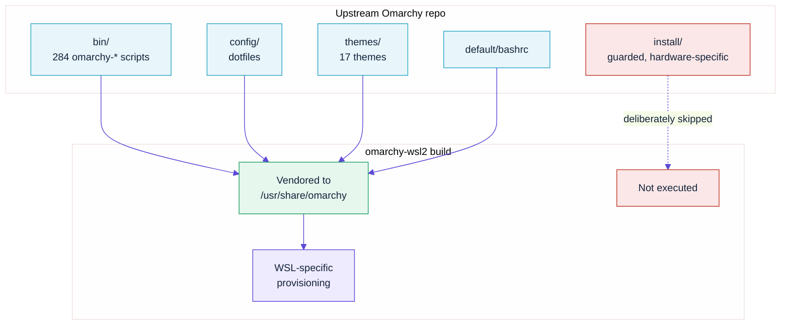
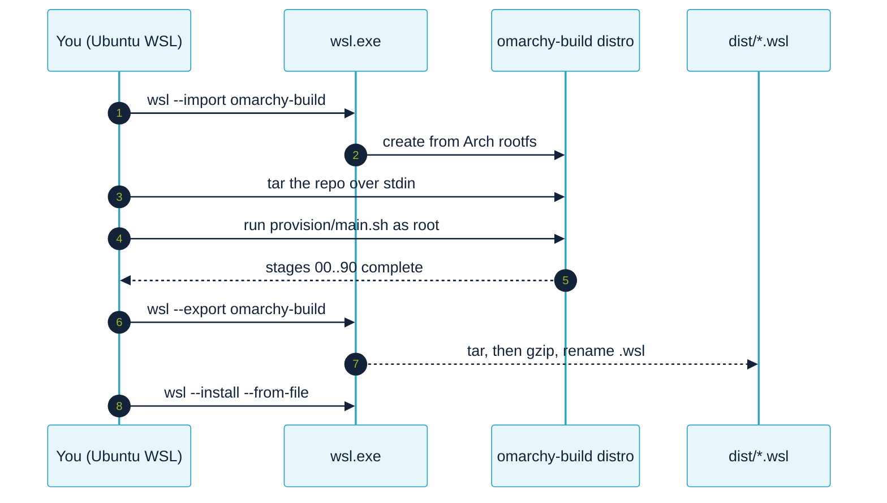

# 01 — Architecture: why this repo exists

## The problem

Omarchy's installer refuses to run under WSL2. This is not a bug — it is an
explicit set of preflight guards.

From `basecamp/omarchy@master:install/preflight/guard.sh`:

```bash
abort() {
  echo -e "\e[31mOmarchy install requires: $1\e[0m"
  gum confirm "Proceed anyway on your own accord and without assistance?" || exit 1
}

[[ ! -f /etc/arch-release ]]              && abort "Vanilla Arch"
(( EUID == 0 ))                           && abort "Running as root (not user)"
[[ $(uname -m) != "x86_64" ]]             && abort "x86_64 CPU"
command -v limine &>/dev/null             || abort "Limine bootloader"
[[ $(findmnt -n -o FSTYPE /) = "btrfs" ]] || abort "Btrfs root filesystem"
```

Under WSL2, four of these fail:

| Guard | Why it fails under WSL2 |
|---|---|
| **not root** | `wsl --import` of an Arch image logs you in as `root` |
| **x86_64** | Fails outright on Windows on ARM |
| **Limine bootloader** | WSL boots a Microsoft-supplied kernel; there is no bootloader |
| **Btrfs root** | WSL root filesystems are ext4 inside a VHDX |

The guards are bypassable — but only through an interactive `gum confirm`,
which a scripted build cannot answer. And bypassing them just moves the failure
later: `install/login/sddm.sh` enables a display manager, `install/login/plymouth.sh`
sets a boot splash, `install/config/hardware/*` applies DMI-matched hardware
quirks, and `post-install/finished.sh` ends with `sudo reboot`. None of these
mean anything in a WSL container.

## What we do instead

We **vendor Omarchy's assets** rather than running its installer.



Everything Omarchy actually *is* from a user's point of view — the `omarchy-*`
commands, the Neovim/tmux/btop/lazygit configs, the theme system, the bash
prompt — lives in `bin/`, `config/`, `themes/` and `default/`. The `install/`
tree only exists to put those files onto bare metal and to configure hardware.
We do that part ourselves, correctly for WSL.

## What we skip, and why

| Upstream step | Skipped because |
|---|---|
| `preflight/guard.sh` | Requires Limine + Btrfs + x86_64 + non-root |
| `login/sddm.sh` | No display manager; WSL has no graphical login |
| `login/plymouth.sh` | No boot splash; WSL doesn't boot |
| `login/limine-snapper.sh` | No bootloader, no Btrfs snapshots |
| `login/hibernation.sh` | No swap device or resume target |
| `config/hardware/*` | Bluetooth, NVIDIA, iwd, brightness, thermald — no such hardware |
| `config/docker.sh` | Conflicts with Docker Desktop's WSL integration and DNS |
| `first-run/firewall.sh` | `ufw` NAT semantics differ under WSL's virtual network |
| `preflight/disable-mkinitcpio.sh` | No initramfs to build |
| `post-install/finished.sh` | Ends in `sudo reboot` |

## What we add

| Addition | Purpose |
|---|---|
| `/etc/wsl.conf` | systemd on, default user, hostname, interop |
| `/etc/wsl-distribution.conf` | OOBE command, uid, Start-menu icon, Terminal profile |
| `/etc/oobe.sh` | First-run account setup (uses `useradd` — Arch has no `adduser`) |
| Masked systemd units | `systemd-resolved`, `NetworkManager`, `tmp.mount` et al. break WSL |
| pacman sandbox workaround | `DownloadUser`/Landlock fails in unprivileged image builds |
| `omarchy-wsl-*` helpers | Mode switching, WSLg env, diagnostics |
| Hyprland WSL overrides | Software cursors, VFR, no direct scanout |

## Why not use the `omarchy` pacman package?

You can — `taufderl/omarchy-wsl` does exactly that, and it's a legitimate
approach that gets you the real dependency graph. The trade-offs:

- **Pro:** exact upstream versions and dependencies.
- **Con:** pulls `limine`, `sddm`, `plymouth`, `snapper` and `btrfs-progs` as
  hard dependencies — hundreds of MB of packages that can never run under WSL.
- **Con:** it's x86_64-only, so there is no ARM64 story at all.

We vendor from git instead, which is architecture-neutral and keeps the image
lean. The cost is that we curate the package list ourselves
(`packages/*.packages`).

## Build isolation

The build never touches your host distro. It imports a throwaway WSL distro
(`omarchy-build`), provisions inside it, exports it, and deletes it.



## Sources

- Omarchy manual — https://omarchy.org/manual/
- Omarchy repo — https://github.com/basecamp/omarchy
- Build a custom WSL distro — https://learn.microsoft.com/windows/wsl/build-custom-distro
- Set up a WSL dev environment — https://learn.microsoft.com/windows/wsl/setup/environment
- Hyprland under WSL (maintainer: "no") — https://github.com/hyprwm/Hyprland/issues/3479
- Omarchy WSL issue (closed, "use a VM") — https://github.com/basecamp/omarchy/issues/469
