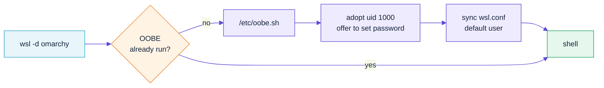

# 02 — Building and registering the distro

Everything runs from an existing WSL2 distro. Ubuntu is the obvious choice.

## Prerequisites

```bash
wsl --version            # need >= 2.4.4; run `wsl --update` if older
```

| Requirement | Why |
|---|---|
| WSL ≥ 2.4.4 | Tar-based `.wsl` distributions and `[oobe]` support |
| ~15 GB free | `desktop` profile; `headless` needs ~4 GB |
| `curl tar gzip python3` | Download, packaging, logo rendering |
| `python3-cairosvg`, `python3-pil` | Only for `make logo` |

```bash
make check      # verifies all of the above
```

## The pipeline

```bash
make all                     # fetch -> seed -> build -> export
make all PROFILE=headless    # smaller, terminal-only image
```

Or run the stages individually:

| Target | What it does |
|---|---|
| `make logo` | Renders `assets/logo.svg` → PNGs + `omarchy-wsl2.ico` |
| `make fetch` | Downloads the Arch base rootfs into `$(CACHE_DIR)` |
| `make seed` | `wsl --import`s it as the throwaway `omarchy-build` distro |
| `make build` | Runs provisioning stages `00`–`90` inside that distro |
| `make export` | `wsl --export` → gzip → `omarchy-<profile>-<arch>.wsl` |
| `make install` | `wsl --install --from-file` |

## Profiles

| Profile | Tiers installed | Approx. size | Use when |
|---|---|---|---|
| `headless` | base | ~2 GB | You only want the terminal |
| `apps` | base + apps | ~5 GB | Terminal + individual GUI apps |
| `desktop` | base + apps + desktop | ~8 GB | You also want Hyprland |

```bash
make all PROFILE=apps
```

## Variables

| Variable | Default | Notes |
|---|---|---|
| `PROFILE` | `desktop` | `headless` \| `apps` \| `desktop` |
| `ARCH` | `$(uname -m)` | `x86_64` \| `aarch64` |
| `NAME` | `omarchy` | Installed distro name |
| `OMARCHY_REF` | `master` | Omarchy git ref (`master` = stable 3.8.5) |
| `OMARCHY_REPO` | `basecamp/omarchy` | Fork-friendly |
| `OMARCHY_THEME` | `Tokyo Night` | Applied at build time |
| `OMARCHY_USER` | `omarchy` | Baked-in uid 1000 account |
| `WIN_ROOT` | `/mnt/c/wsl/omarchy-wsl2` | Where cache/build/dist live |

Artefacts default to the Windows drive because `wsl.exe --import` and
`--export` need Windows paths, and multi-GB files over the 9p bridge are slow.

```bash
make all PROFILE=desktop OMARCHY_THEME="Catppuccin" NAME=omarchy-dev
```

## How the tarball is prepared

Microsoft's spec says a `.wsl` file is a **gzip-compressed tar of the root
filesystem**, with the filesystem root at the tar root.

`make export` does this:

```bash
wsl --terminate omarchy-build                       # flush the VHDX
wsl --export omarchy-build dist/omarchy.tar         # uncompressed tar
gzip -9 -c dist/omarchy.tar > dist/omarchy-...wsl   # gzip = widest compat
sha256sum ... > dist/omarchy-...wsl.sha256
```

If you'd rather build a rootfs by hand, the equivalent manual recipe from
[the Microsoft docs](https://learn.microsoft.com/windows/wsl/build-custom-distro) is:

```bash
cd /path/to/rootfs
tar --numeric-owner --absolute-names -c * | gzip --best > ../install.tar.gz
mv ../install.tar.gz ../omarchy.wsl
```

### Packaging rules the build enforces

`scripts/provision/90-cleanup.sh` verifies each of these before export:

- ✅ `/etc/wsl.conf` and `/etc/wsl-distribution.conf` present, `root:root`, `0644`
- ✅ `oobe.defaultUid` and the baked account are both `1000`
- ✅ `oobe.defaultName` set (required for double-click install)
- ✅ `shortcut.icon` points at a real `.ico`
- ❌ no `/etc/resolv.conf` (WSL generates it)
- ✅ a uid 0 `root` entry in `/etc/passwd`
- ❌ no password hashes in `/etc/shadow`
- ❌ no kernel or initramfs in the archive

## Registering the distro

### Simplest

```bash
make install
```

which runs:

```powershell
wsl --install --from-file C:\wsl\omarchy-wsl2\dist\omarchy-desktop-x86_64.wsl --name omarchy
```

### By double-click

Open the `.wsl` file in Explorer. This works because
`/etc/wsl-distribution.conf` sets `[oobe] defaultName`.

### Classic import (no OOBE)

```powershell
wsl --import omarchy C:\wsl\omarchy C:\path\to\omarchy.tar --version 2
```

`--import` does **not** run `oobe.command`, so you land as `root` and must set
the default user yourself:

```powershell
wsl --manage omarchy --set-default-user omarchy
```

### Publishing it in `wsl --list --online`

For your own machines or an enterprise fleet, override the distribution
manifest. `windows/Override-Manifest.ps1` in this repo automates it:

```powershell
# elevated PowerShell
.\windows\Override-Manifest.ps1 -WslPath C:\wsl\omarchy-wsl2\dist\omarchy-desktop-x86_64.wsl
wsl --list --online          # omarchy now appears
wsl --install omarchy
```

It writes `HKLM\SOFTWARE\Microsoft\Windows\CurrentVersion\Lxss\DistributionListUrl`.
Delete that value to revert to the official list.

## Rebuilding and iterating

```bash
make build PROFILE=desktop   # re-provision without re-downloading
make shell                   # root shell inside the build distro
make clean                   # drop the build distro
make distclean               # also drop the cache and dist output
```

Individual stages can be re-run in isolation:

```bash
wsl -d omarchy-build -u root -- \
  env OMARCHY_WSL_PROFILE=desktop bash /tmp/omarchy-wsl2-src/scripts/provision/70-theme.sh
```

## First launch



> `oobe.sh` always exits 0. A non-zero exit makes WSL refuse to open a shell at
> all — which would lock you out of your own image.

Verify afterwards:

```bash
wsl -d omarchy -- omarchy-wsl-doctor
```
