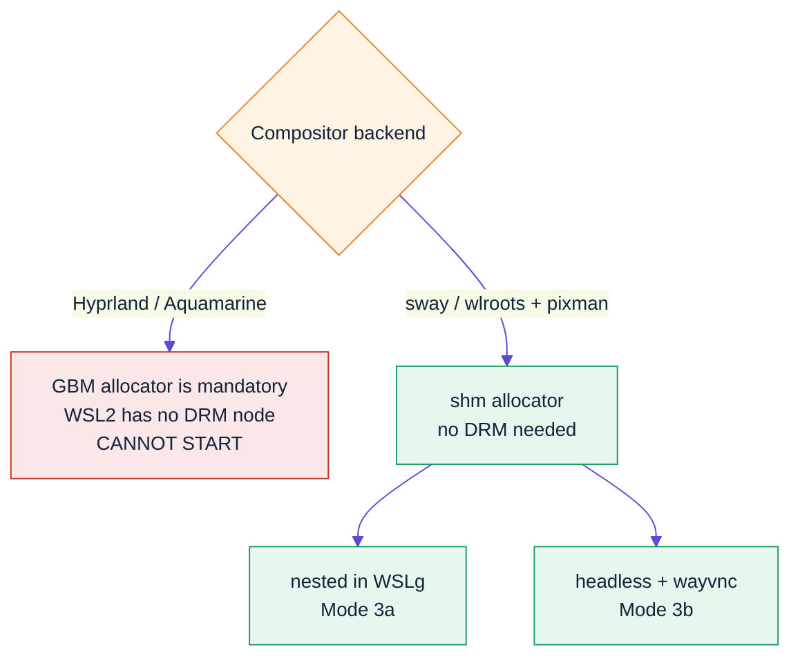
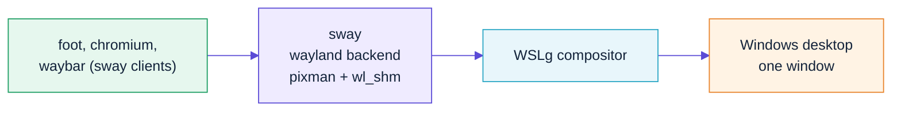
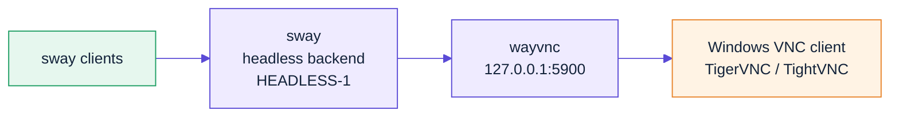
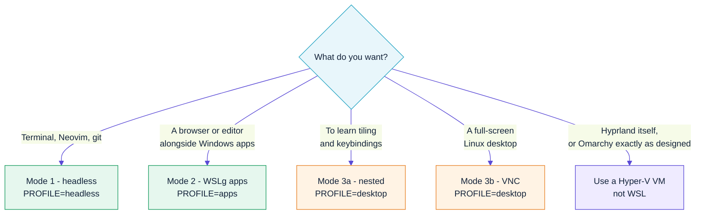

# 03 — The three run modes

## The constraint that shapes everything

WSL2 gives you a **virtual GPU at `/dev/dxg`** (Direct3D12-backed) for
*rendering*. It does **not** give you a `/dev/dri/cardN`, and — crucially —
**no render node either**.

Hyprland ≥ 0.45 uses **Aquamarine**, which unconditionally builds a GBM
allocator from a DRM node. Without one, every backend it offers fails:

```
CRIT from aquamarine ]: Cannot open backend: no allocator available
CRIT ]: Critical error thrown: CBackend::create() failed!
```

Nested mode fails for a second, independent reason: WSLg's compositor
advertises `wl_shm` but **not** `zwp_linux_dmabuf_v1`, which Aquamarine
requires.

```
ERR from aquamarine ]: Wayland backend cannot start: Missing protocols
```

This matches [hyprwm/Hyprland#3479](https://github.com/hyprwm/Hyprland/issues/3479),
where the maintainer's entire reply was: *"no."*

**wlroots is different.** It falls back to a shared-memory allocator when
neither backend nor renderer needs DMABUF, and that path requires no DRM node
at all. So the desktop we ship is **sway** with `WLR_RENDERER=pixman`.

The full analysis — including the `vkms` experiment that got Hyprland running
right up to the point of allocating a scanout buffer — is in
[12-wayland-on-wsl2.md](12-wayland-on-wsl2.md).



---

## Mode 1 — Headless (terminal only)

The mode that works flawlessly, and the one most people will live in.

```bash
wsl -d omarchy
```

You get Omarchy's full terminal environment: the bash config and prompt,
Neovim, `lazygit`, `btop`, `fzf`, `zoxide`, `eza`, `bat`, `ripgrep`, `tmux`,
`fastfetch`, and the `omarchy-*` command suite.

Build the smallest possible image for this:

```bash
make all PROFILE=headless
```

Nothing extra is needed — no WSLg, no GPU, no systemd graphics stack.

### Making it feel like Omarchy

Windows Terminal is your "compositor" here. Import the matching colour scheme:

```bash
omarchy-wsl-theme-terminal            # prints a Windows Terminal fragment
```

See [05-theming.md](05-theming.md).

---

## Mode 2 — Individual GUI apps through WSLg

WSLg runs a Weston-based compositor on the Windows side and publishes a Wayland
socket into every WSL2 distro. Wayland and X11 clients connect to it and appear
as **ordinary Windows windows**, with taskbar entries and alt-tab.

```bash
omarchy-wsl-app chromium
omarchy-wsl-app foot
omarchy-wsl-app nautilus ~/code
```

After your first interactive login, `~/.config/omarchy-wsl2/env.sh` is sourced
from `.bashrc`, so plain commands work too:

```bash
chromium &
mpv video.mkv
```

### What `omarchy-wsl-app` sets up

WSLg publishes its socket in `/mnt/wslg/runtime-dir`, but with systemd enabled
`XDG_RUNTIME_DIR` is `/run/user/1000`. Wayland clients only look inside
`XDG_RUNTIME_DIR`, so the helper symlinks the socket across:

```bash
ln -s /mnt/wslg/runtime-dir/wayland-0 /run/user/1000/wayland-0
```

It then exports:

| Variable | Value | Purpose |
|---|---|---|
| `WAYLAND_DISPLAY` | `wayland-0` | Wayland socket name |
| `DISPLAY` | `:0` | XWayland, for X11-only apps |
| `PULSE_SERVER` | `/mnt/wslg/PulseServer` | Audio |
| `GALLIUM_DRIVER` | `d3d12` | Mesa's Direct3D12 driver → GPU acceleration |
| `LIBVA_DRIVER_NAME` | `d3d12` | Hardware video decode |
| `QT_QPA_PLATFORM` | `wayland;xcb` | Qt prefers Wayland, falls back to X11 |
| `GDK_BACKEND` | `wayland,x11` | Same for GTK |
| `MOZ_ENABLE_WAYLAND` | `1` | Firefox/Chromium native Wayland |

If `/dev/dxg` is missing, it sets `LIBGL_ALWAYS_SOFTWARE=1` instead.

### Check your acceleration

```bash
omarchy-wsl-doctor
glxinfo -B | grep "OpenGL renderer"
```

You want to see `D3D12` — not `llvmpipe`. If you get `llvmpipe` on an Intel
iGPU, that's [microsoft/wslg#996](https://github.com/microsoft/wslg/issues/996):

```bash
sudo ln -s /usr/lib/libedit.so /usr/lib/libedit.so.2
```

---

## Mode 3 — The full tiling desktop

Requires `PROFILE=desktop`. The compositor is **sway**, configured to
reproduce Omarchy's keybindings, gaps and theming. See
[12-wayland-on-wsl2.md](12-wayland-on-wsl2.md) for why it isn't Hyprland.

### Mode 3a — Nested inside WSLg

sway runs as a Wayland client of WSLg. You get one resizable window on your
Windows desktop containing a complete tiling session — waybar, launcher, tiled
terminals, keybindings.

```bash
omarchy-wsl-desktop
```



This works because wlroots' Wayland backend accepts `wl_shm` buffers — the
very thing WSLg does offer. Maximise the window like any other.

**Pros:** low latency, clipboard integration, no VNC client needed.
**Cons:** it's a window, not a session; the outer compositor owns some input
focus, so session-lock and global-hotkey behaviour is imperfect.

### Mode 3b — Headless + VNC

sway runs on its headless backend against a virtual output, and `wayvnc`
serves that output. This is the closest thing to a "real" desktop: resizable,
full-screen capable, independent of WSLg.

```bash
omarchy-wsl-desktop vnc --size 2560x1440
```



Install a viewer on Windows and connect to `127.0.0.1:5900`:

```powershell
winget install -e --id TigerVNC.TigerVNC
```

> RealVNC's winget manifest currently 404s on download; TigerVNC works.

Options:

```bash
omarchy-wsl-desktop vnc --size 1920x1080 --port 5901
omarchy-wsl-desktop vnc --bind 0.0.0.0        # only if you really mean it
```

**Pros:** true full-screen, any resolution, survives Terminal closing.
**Cons:** VNC round-trip latency; CPU rendering via `pixman`.

> **Security:** `wayvnc` binds **`127.0.0.1`** by default, so it is reachable
> from Windows via WSL2's localhost forwarding but not from your LAN. Only
> pass `--bind 0.0.0.0` if you intend to expose it, and set a `wayvnc`
> password if you do.

### Choosing tiling or floating

Omarchy is a **tiling** environment: windows arrange themselves, have no
titlebars, and you drive them from the keyboard. That is the point of it — but
it is a real adjustment if you are coming from Windows or GNOME, so this
project makes it a choice.

```bash
omarchy-wsl-desktop --floating     # draggable windows with titlebars
omarchy-wsl-desktop --tiling       # Omarchy's model (default)
```

The setting is written to `~/.config/sway/local.conf` and persists. The wizard
also asks, and `make build OMARCHY_LAYOUT=floating` bakes it into the image.

Either way, per-window control is always available:

| Key | Action |
|---|---|
| `SUPER+Shift+Space` | Toggle the focused window between tiled and floating |
| `SUPER` + left-drag | Move a floating window |
| `SUPER` + right-drag | Resize any window |
| `SUPER+R`, then arrows/`hjkl` | Resize a tiled window, `Esc` to finish |

**If you are new to tiling, five keys get you productive:**
`SUPER+Return` (terminal), `SUPER+W` (close), `SUPER+Space` (launcher),
`SUPER+H`/`SUPER+L` (focus left/right), `SUPER+F` (fullscreen).

### Running full screen

VNC mode is the right answer — nested mode is a WSLg child window and can only
ever be as big as that window.

1. **Match your Windows resolution**, so there are no black bars and no
   scrolling. The wizard detects it for you; manually:

   ```powershell
   (Get-CimInstance Win32_VideoController).CurrentHorizontalResolution
   (Get-CimInstance Win32_VideoController).CurrentVerticalResolution
   ```

2. **Start the desktop at that size:**

   ```bash
   omarchy-wsl-desktop vnc --size 2560x1440
   ```

3. **Connect the viewer full-screen:**

   ```powershell
   & "C:\Program Files\TigerVNC\vncviewer.exe" -FullScreen 127.0.0.1:5900
   ```

   `F8` in-session opens TigerVNC's menu to toggle full screen or disconnect.
   For multi-monitor, `F8` → Options → Screen → "Full screen mode: All
   monitors", with `--size` set to the combined width.

> **Performance note.** Everything is CPU-rendered, so higher resolutions cost
> real frame time. If 1440p feels sluggish, run `--size 1920x1080` and let
> TigerVNC scale it up — usually the better trade. See
> [12-wayland-on-wsl2.md](12-wayland-on-wsl2.md#6-what-this-costs-you).

### Trying Hyprland anyway

```bash
omarchy-wsl-desktop --compositor hyprland
```

This prints an explanation and then attempts it, so you can see the failure
first-hand. It exists so the session starts working automatically if
Aquamarine ever gains a shm allocator.

---

## Which mode should you use?



## Feature reality check

| Omarchy feature | Mode 1 | Mode 2 | Mode 3a | Mode 3b |
|---|---|---|---|---|
| Omarchy CLI + themes | ✅ | ✅ | ✅ | ✅ |
| Neovim / lazygit / btop | ✅ | ✅ | ✅ | ✅ |
| GUI apps | — | ✅ | ✅ | ✅ |
| Tiling window management | — | — | ✅ sway | ✅ sway |
| Waybar | — | — | ✅ | ✅ |
| Omarchy keybindings | — | — | ⚠️ outer compositor steals some | ✅ |
| Hyprland itself | — | — | ❌ cannot start on WSL2 | ❌ cannot start on WSL2 |
| Animations / blur | — | — | ❌ not in sway | ❌ not in sway |
| GPU acceleration | — | ✅ d3d12 | ⚠️ pixman (CPU) | ⚠️ pixman (CPU) |
| Screen lock | — | — | ⚠️ swaylock | ⚠️ swaylock |
| hypridle / hyprlock / hyprsunset | — | — | ❌ Hyprland-only | ❌ Hyprland-only |
| Multi-monitor | — | ✅ native Windows | ❌ single output | ❌ single output |
| Audio | — | ✅ | ✅ | ⚠️ no VNC audio channel |

Mode 3 trades Hyprland's animations and `hypr*` daemons for a desktop that
actually starts. Everything Omarchy does *outside* the compositor — the
theme system, the CLI, waybar, the app suite — carries across.

## Why not RDP or `xrdp`?

WSLg already *is* an RDP client — it uses MSRDC internally to project
individual windows. Layering `xrdp` on top means running a second X server and
losing WSLg's GPU path. `wayvnc` against sway's own headless output is
simpler and keeps the session natively Wayland, which is what Omarchy's
tooling expects.
