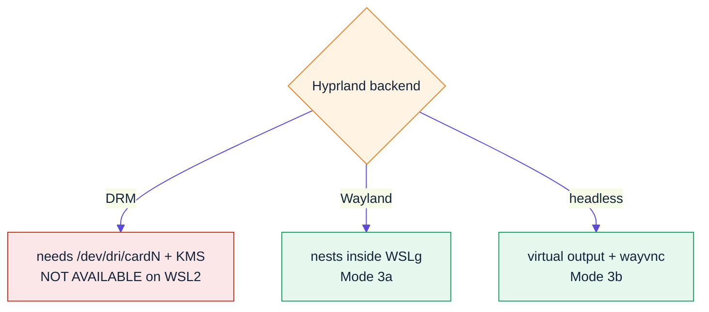
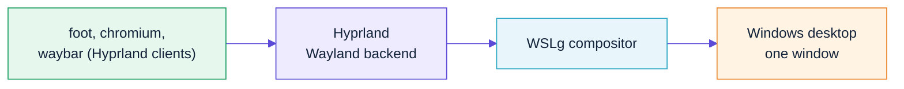
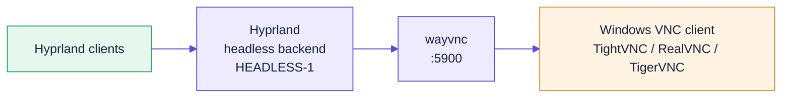
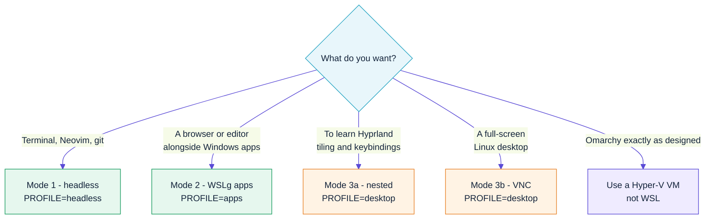

# 03 — The three run modes

## The constraint that shapes everything

WSL2 gives you a **virtual GPU at `/dev/dxg`** (Direct3D12-backed) for
*rendering*. It does **not** give you a `/dev/dri/cardN` with kernel
mode-setting.

Hyprland (via wlroots/Aquamarine) normally uses its **DRM backend** to take
over a physical display. With no KMS device, that backend aborts:

```
wlr_backend_get_drm_fd() failed!
```

This is [hyprwm/Hyprland#3479](https://github.com/hyprwm/Hyprland/issues/3479),
where the maintainer's entire reply was: *"no."*

So a Hyprland session that **owns your screen** is not achievable under WSL2 —
by anyone, in any project. What *is* achievable is Hyprland running as a
**Wayland client** (nested) or on its **headless backend** behind a VNC server.



---

## Mode 1 — Headless (terminal only)

The mode that works flawlessly, and the one most people will live in.

```bash
wsl -d omarchy
```

You get Omarchy's full terminal environment: the bash config and prompt,
Neovim, `lazygit`, `btop`, `fzf`, `zoxide`, `eza`, `bat`, `ripgrep`, `tmux`,
`fastfetch`, and the `omarchy-*` command suite.

Build the smallest possible image for this:

```bash
make all PROFILE=headless
```

Nothing extra is needed — no WSLg, no GPU, no systemd graphics stack.

### Making it feel like Omarchy

Windows Terminal is your "compositor" here. Import the matching colour scheme:

```bash
omarchy-wsl-theme-terminal            # prints a Windows Terminal fragment
```

See [05-theming.md](05-theming.md).

---

## Mode 2 — Individual GUI apps through WSLg

WSLg runs a Weston-based compositor on the Windows side and publishes a Wayland
socket into every WSL2 distro. Wayland and X11 clients connect to it and appear
as **ordinary Windows windows**, with taskbar entries and alt-tab.

```bash
omarchy-wsl-app chromium
omarchy-wsl-app foot
omarchy-wsl-app nautilus ~/code
```

After your first interactive login, `~/.config/omarchy-wsl2/env.sh` is sourced
from `.bashrc`, so plain commands work too:

```bash
chromium &
mpv video.mkv
```

### What `omarchy-wsl-app` sets up

WSLg publishes its socket in `/mnt/wslg/runtime-dir`, but with systemd enabled
`XDG_RUNTIME_DIR` is `/run/user/1000`. Wayland clients only look inside
`XDG_RUNTIME_DIR`, so the helper symlinks the socket across:

```bash
ln -s /mnt/wslg/runtime-dir/wayland-0 /run/user/1000/wayland-0
```

It then exports:

| Variable | Value | Purpose |
|---|---|---|
| `WAYLAND_DISPLAY` | `wayland-0` | Wayland socket name |
| `DISPLAY` | `:0` | XWayland, for X11-only apps |
| `PULSE_SERVER` | `/mnt/wslg/PulseServer` | Audio |
| `GALLIUM_DRIVER` | `d3d12` | Mesa's Direct3D12 driver → GPU acceleration |
| `LIBVA_DRIVER_NAME` | `d3d12` | Hardware video decode |
| `QT_QPA_PLATFORM` | `wayland;xcb` | Qt prefers Wayland, falls back to X11 |
| `GDK_BACKEND` | `wayland,x11` | Same for GTK |
| `MOZ_ENABLE_WAYLAND` | `1` | Firefox/Chromium native Wayland |

If `/dev/dxg` is missing, it sets `LIBGL_ALWAYS_SOFTWARE=1` instead.

### Check your acceleration

```bash
omarchy-wsl-doctor
glxinfo -B | grep "OpenGL renderer"
```

You want to see `D3D12` — not `llvmpipe`. If you get `llvmpipe` on an Intel
iGPU, that's [microsoft/wslg#996](https://github.com/microsoft/wslg/issues/996):

```bash
sudo ln -s /usr/lib/libedit.so /usr/lib/libedit.so.2
```

---

## Mode 3 — The full Hyprland desktop

Requires `PROFILE=desktop`.

### Mode 3a — Nested inside WSLg

Hyprland runs as a Wayland client of WSLg. You get one Hyprland window on your
Windows desktop, containing a complete tiling session — waybar, your launcher,
tiled terminals, keybindings, animations.

```bash
omarchy-wsl-desktop
```



Modern Hyprland auto-selects its Wayland backend when `WAYLAND_DISPLAY` is set.
The helper also exports `WLR_BACKENDS=wayland` for older builds.

**Pros:** low latency, shares the WSLg GPU path, clipboard integration.
**Cons:** it's a window, not a session. Some protocols (idle inhibit, session
lock, global hotkeys) behave oddly because the outer compositor owns input focus.

If it fails to start, force software rendering:

```bash
omarchy-wsl-desktop --software
```

### Mode 3b — Headless + VNC

Hyprland runs on its headless backend against a virtual output, and `wayvnc`
serves that output over VNC. This is the closest thing to a "real" desktop:
resizable, full-screen capable, and independent of WSLg's window.

```bash
omarchy-wsl-desktop vnc --size 2560x1440
```



Then connect a Windows VNC client to `127.0.0.1:5900`. WSL2's localhost
forwarding makes the port reachable from Windows with no extra configuration.

Options:

```bash
omarchy-wsl-desktop vnc --size 1920x1080 --port 5901
omarchy-wsl-desktop vnc --software        # if rendering misbehaves
```

**Pros:** true full-screen, multi-resolution, survives Terminal closing.
**Cons:** VNC round-trip latency; software rendering (`pixman`) by default,
because the headless backend has no d3d12 path.

> **Security:** `wayvnc` binds `0.0.0.0` so Windows can reach it. WSL2's
> network is NAT'd and not exposed to your LAN by default, but if you have
> mirrored networking mode enabled, bind to localhost or set a `wayvnc`
> password.

---

## Which mode should you use?



## Feature reality check

| Omarchy feature | Mode 1 | Mode 2 | Mode 3a | Mode 3b |
|---|---|---|---|---|
| Omarchy CLI + themes | ✅ | ✅ | ✅ | ✅ |
| Neovim / lazygit / btop | ✅ | ✅ | ✅ | ✅ |
| GUI apps | — | ✅ | ✅ | ✅ |
| Tiling window management | — | — | ✅ | ✅ |
| Waybar | — | — | ✅ | ✅ |
| Hyprland keybindings | — | — | ⚠️ outer compositor steals some | ✅ |
| Animations / blur | — | — | ✅ | ⚠️ software rendering |
| GPU acceleration | — | ✅ d3d12 | ✅ d3d12 | ⚠️ pixman |
| Screen lock (hyprlock) | — | — | ❌ | ⚠️ |
| hypridle / hyprsunset | — | — | ❌ no physical session | ❌ |
| Multi-monitor | — | ✅ native Windows | ❌ single output | ❌ single output |
| Audio | — | ✅ | ✅ | ⚠️ no VNC audio channel |

## Why not RDP or `xrdp`?

WSLg already *is* an RDP client — it uses MSRDC internally to project
individual windows. Layering `xrdp` on top means running a second X server and
losing WSLg's GPU path. `wayvnc` against Hyprland's own headless output is
simpler and keeps the session natively Wayland, which is what Omarchy expects.
