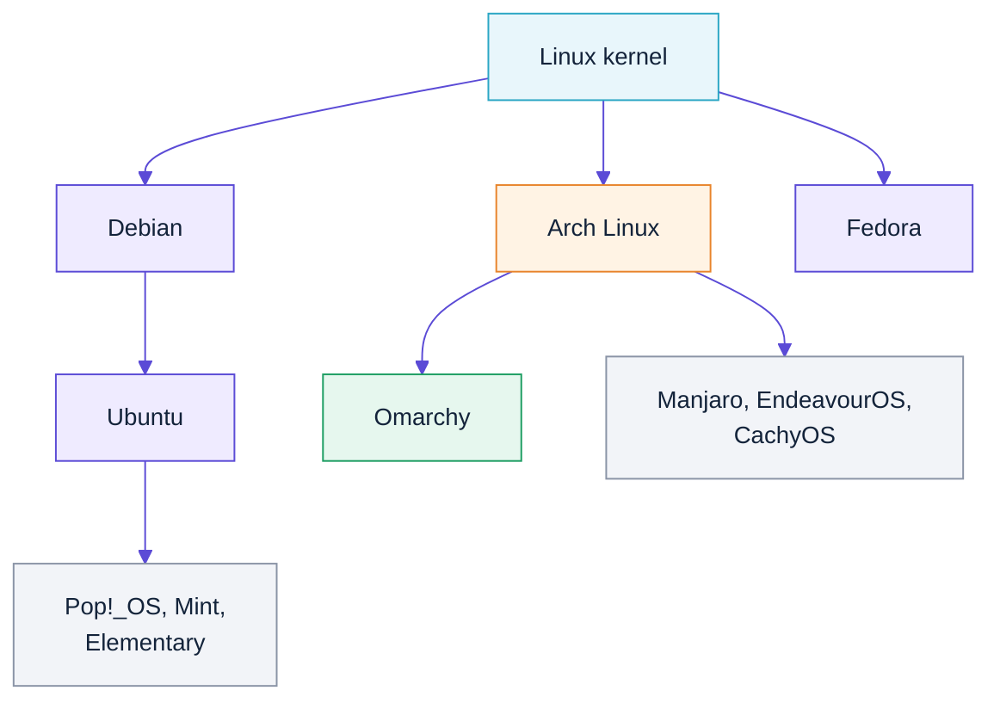

# 07 — Coming from Ubuntu? Start here

## Is Omarchy original, or a derivative?

**Omarchy is a derivative of Arch Linux.** It is not its own kernel, libc, init
system or package manager. From the [Omarchy manual](https://omarchy.org/manual/):

> Omarchy is an omakase Linux distribution based on **Arch**, the tiling window
> manager **Hyprland**, and the desktop construction-kit **Quickshell**.

So the family tree is:



"Omakase" is a sushi term — *"I'll leave it up to you."* The chef chooses. The
philosophy is that Omarchy makes every configuration decision **for** you, with
strong opinions, so you don't spend three weekends assembling a desktop. That's
the actual innovation: not new plumbing, but a curated, coherent set of
defaults, dotfiles and themes on top of standard Arch.

Concretely, Omarchy is:
- Arch Linux (kernel, glibc, systemd, pacman) — unchanged
- Hyprland + Quickshell — standard upstream projects
- ~284 `omarchy-*` shell scripts, a `config/` dotfile tree, and 17 themes
- A pacman repo (`pkgs.omarchy.org`) with prebuilt convenience packages

## How much do you actually need to learn?

**Less than you'd fear for the CLI. More than you'd like for the desktop.**

| Area | Change from Ubuntu | Effort |
|---|---|---|
| Shell, files, permissions, pipes | **Zero.** Same bash, same coreutils, same everything | None |
| SSH, git, Docker, Python, Node | **Zero.** Identical | None |
| Package manager | `apt` → `pacman` | ~20 minutes |
| Release model | Fixed releases → **rolling** | Conceptual shift |
| Init / services | **Zero.** Both use systemd | None |
| Desktop | GNOME (mouse-driven) → **Hyprland (keyboard-driven tiling)** | Days to weeks |
| Config style | GUI settings panels → **editing text files** | Ongoing |

If you stay in Mode 1 (terminal), your muscle memory transfers almost entirely.
The real learning curve is Hyprland, not Arch.

## apt → pacman

| Task | Ubuntu | Omarchy / Arch |
|---|---|---|
| Refresh package lists | `sudo apt update` | *(implicit)* |
| Upgrade everything | `sudo apt upgrade` | `sudo pacman -Syu` |
| Install | `sudo apt install foo` | `sudo pacman -S foo` |
| Remove | `sudo apt remove foo` | `sudo pacman -R foo` |
| Remove + unused deps | `sudo apt autoremove foo` | `sudo pacman -Rns foo` |
| Search | `apt search foo` | `pacman -Ss foo` |
| Show package info | `apt show foo` | `pacman -Si foo` |
| List installed | `apt list --installed` | `pacman -Q` |
| Which package owns a file | `dpkg -S /usr/bin/foo` | `pacman -Qo /usr/bin/foo` |
| List a package's files | `dpkg -L foo` | `pacman -Ql foo` |
| Clean the cache | `sudo apt clean` | `sudo pacman -Sc` |
| Extra software | PPAs | **AUR** via `yay -S foo` |

The single most important difference:

> **Never run `pacman -Sy foo`.** Refreshing the database without a full upgrade
> gives you a "partial upgrade", which breaks Arch systems. Always `pacman -Syu`.

Ubuntu's `apt update && apt install foo` habit maps to `pacman -Syu foo`, not
`pacman -Sy foo`.

### Omarchy's wrappers

```bash
omarchy-pkg-add foo         # thin wrapper over pacman -S --needed
omarchy-update              # update Omarchy itself + system packages
omarchy-update-available    # is there anything to do?
```

## Concept mapping

| Ubuntu concept | Omarchy equivalent |
|---|---|
| `apt` / `.deb` | `pacman` / `.pkg.tar.zst` |
| PPA | AUR (`yay`), or `pkgs.omarchy.org` |
| `/etc/apt/sources.list` | `/etc/pacman.conf` + `/etc/pacman.d/mirrorlist` |
| `do-release-upgrade` every 6 months | Rolling — `pacman -Syu` is the release |
| `update-alternatives` | Usually just symlinks |
| `ufw` | `ufw` (same tool) |
| `snap` / `flatpak` | AUR, or flatpak if you install it |
| GNOME Settings | Text files in `~/.config/` |
| GNOME Software | `pacman` / `yay` / `walker` |
| `gnome-terminal` | `foot` (Omarchy's default) |
| Nautilus | Nautilus (same) |
| Alt-Tab window switching | Hyprland workspaces + `SUPER` keybindings |
| `systemctl` | `systemctl` (identical) |
| `journalctl` | `journalctl` (identical) |

## Rolling release: what it means day to day

Ubuntu gives you a frozen snapshot for 6 months or 5 years, with security
backports. Arch gives you upstream's latest, continuously.

**Practical consequences:**

- Update **regularly** (weekly-ish). Leaving it 6 months then updating is the
  main way people break Arch.
- Read [archlinux.org/news](https://archlinux.org/news/) before big updates —
  occasional manual intervention is announced there.
- You get new kernels, Mesa, and Hyprland releases almost immediately.
- There is no `do-release-upgrade`; there is no "version" to be on.

Under WSL2 this is lower-risk than bare metal: you don't have a bootloader or
GPU drivers to break, and you can snapshot the whole distro:

```powershell
wsl --export omarchy C:\backups\omarchy-2026-08-29.tar
```

## Things that will surprise you

1. **`adduser` doesn't exist.** Use `useradd -m -G wheel name`.
2. **`sudo` is via the `wheel` group**, configured in `/etc/sudoers.d/`.
3. **No `/etc/default/*` convention.** Config lives where upstream put it.
4. **Package names differ**: `build-essential` → `base-devel`,
   `python3` → `python`, `nodejs npm` → `nodejs npm` (same), `libfoo-dev` → `libfoo`.
   Arch ships headers in the main package; there are no `-dev` splits.
5. **Man pages and the [Arch Wiki](https://wiki.archlinux.org) are the docs.**
   The Arch Wiki is genuinely the best Linux documentation that exists — use it
   even for Ubuntu questions.
6. **The AUR is user-submitted.** Read `PKGBUILD`s before installing.

## Your first hour, translated

```bash
# Ubuntu habit                     # Omarchy equivalent
sudo apt update && sudo apt upgrade
                                   sudo pacman -Syu

sudo apt install ripgrep fd-find   sudo pacman -S ripgrep fd
                                   # (already installed by omarchy-wsl2)

sudo apt install build-essential   sudo pacman -S base-devel

snap install code --classic        # Use VS Code on Windows + the WSL extension
                                   # see docs/06-dev-tools.md

systemctl status foo               systemctl status foo      # identical
journalctl -u foo -f               journalctl -u foo -f      # identical
```

## Should you switch?

Honest guidance:

- **Staying in the terminal?** The switch costs you an afternoon and buys you
  newer packages, the AUR, and Omarchy's genuinely lovely defaults.
- **Want the tiling desktop?** Budget a week of muscle-memory rebuilding, and
  note that under WSL2 you get modes 3a/3b, not the real thing
  ([03-modes.md](03-modes.md)).
- **Need long-term stability for production servers?** Stay on Ubuntu. Rolling
  release is the wrong trade for a server you don't touch for a year.

A pragmatic pattern: keep Ubuntu as your default WSL distro for work that needs
it, and run `omarchy` alongside. WSL makes having both essentially free.

```bash
wsl -d Ubuntu
wsl -d omarchy
wsl --set-default omarchy    # if you're convinced
```

> **Multiple distros + systemd:** WSL can't run systemd in two distros whose
> default users share the same UID. If you hit trouble, give one distro a
> different default UID.

## Further reading

- [Arch Wiki: Pacman/Rosetta](https://wiki.archlinux.org/title/Pacman/Rosetta) — apt↔pacman↔dnf table
- [Arch Wiki: General recommendations](https://wiki.archlinux.org/title/General_recommendations)
- [Arch Wiki: System maintenance](https://wiki.archlinux.org/title/System_maintenance)
- [Omarchy manual](https://omarchy.org/manual/)
- [Hyprland wiki](https://wiki.hypr.land/)
