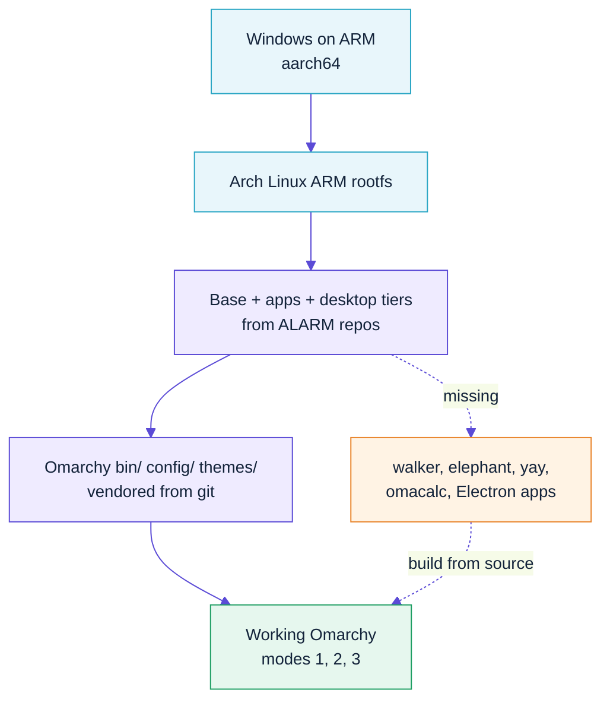

# 08 — Windows on ARM (aarch64)

**Short answer: yes, ARM64 works — with substitutions, and you will compile a
few things yourself.**

## The situation

Three separate facts matter, and they're often conflated:

| Question | Answer |
|---|---|
| Does **Arch Linux** support ARM64? | No. Arch proper is x86_64-only. |
| Does **Arch Linux ARM** support it? | Yes — a separate project, [archlinuxarm.org](https://archlinuxarm.org) |
| Does **Omarchy's pacman repo** support it? | Effectively no — see below |

### Verified: Omarchy's repo is x86_64-only

Querying `pkgs.omarchy.org` directly:

| Architecture | Packages in `omarchy.db` |
|---|---|
| `x86_64` | **203** — including `omarchy`, `omarchy-settings`, `walker`, `elephant`, `omarchy-nvim`, `omarchy-chromium`, `yay`, `omacalc` |
| `aarch64` | **1** — `omarchy-keyring` only |

So the aarch64 repo path exists but is a placeholder. Anything Omarchy builds
itself must come from source on ARM.

### Verified: Arch Linux ARM has the desktop stack

The good news, from `mirror.archlinuxarm.org/aarch64/extra`:

```
hyprland-0.56.1        quickshell-0.3.1      waybar-0.15.0
hyprlock-0.9.6         hypridle-0.1.8        hyprpaper-0.8.4
hyprpicker-0.4.7       hyprcursor-0.1.13     hyprutils-0.14.1
xdg-desktop-portal-hyprland-1.4.1            wayvnc-0.10.1
foot-1.27.0            alacritty-0.17.0      kitty-0.48.2
mako-1.11.0            swaybg-1.2.2          wofi-1.5.3
seatd-0.9.3            sway-1.12             niri-26.04
```

Hyprland, Quickshell, waybar and wayvnc are **all present for aarch64**. That's
why the `desktop` profile builds on ARM.

### Upstream blocks ARM anyway

`install/preflight/guard.sh:26-28`:

```bash
if [[ $(uname -m) != "x86_64" ]]; then
  abort "x86_64 CPU"
fi
```

Another reason this project doesn't run upstream's installer.

## Building on ARM64

Exactly the same commands — architecture is auto-detected:

```bash
make check          # warns about the x86_64-only repo
make all
make install
```

The build uses the [Arch Linux ARM generic aarch64 rootfs](http://os.archlinuxarm.org/os/ArchLinuxARM-aarch64-latest.tar.gz)
instead of the official Arch WSL image, populates the `archlinuxarm` keyring,
and skips the `[omarchy]` repo entirely.

Anything unavailable is logged rather than fatal:

```bash
wsl -d omarchy -- cat /var/log/omarchy-wsl2-missing.log
```

## What you get vs. lose

| Component | x86_64 | aarch64 | Substitute on ARM |
|---|---|---|---|
| Omarchy `bin/` + `config/` + themes | ✅ | ✅ | — (vendored from git, arch-neutral) |
| Hyprland | ✅ | ✅ | ALARM `extra` |
| Quickshell | ✅ | ✅ | ALARM `extra` |
| waybar / mako / swaybg | ✅ | ✅ | ALARM `extra` |
| foot terminal | ✅ | ✅ | ALARM `extra` |
| wayvnc | ✅ | ✅ | ALARM `extra` |
| Chromium | `omarchy-chromium` | ✅ | ALARM `chromium` |
| Neovim | `omarchy-nvim` | ⚠️ | plain `neovim` + Omarchy's config |
| Launcher | `walker` + `elephant` | ❌ | `wofi` (installed by default) |
| `omacalc` / `omacut` / `omawrite` | ✅ | ❌ | build from source |
| `yay` (AUR helper) | ✅ | ❌ | build from source — see below |
| 1Password, Spotify, Obsidian | ✅ | ❌ | no ARM64 Linux builds |

## Compiling the missing pieces

### yay (AUR helper) — do this first

Everything else gets easier once you have it.

```bash
sudo pacman -S --needed git base-devel go
git clone https://aur.archlinux.org/yay.git /tmp/yay
cd /tmp/yay && makepkg -si --noconfirm
```

### walker + elephant (Omarchy's launcher)

Both are Go, so they cross-compile cleanly:

```bash
sudo pacman -S go

git clone https://github.com/abenz1267/walker /tmp/walker
cd /tmp/walker && go build -o walker ./cmd/walker
sudo install -m755 walker /usr/local/bin/

git clone https://github.com/abenz1267/elephant /tmp/elephant
cd /tmp/elephant && go build -o elephant ./cmd/elephant
sudo install -m755 elephant /usr/local/bin/
```

### omarchy-nvim

It's a Neovim config, not a binary — Omarchy's own `config/nvim` is already
installed to `~/.config/nvim` by the build. Nothing to compile.

### Omarchy's small GUI apps

`omacalc`, `omacut`, `omawrite` and `cliamp` build from their upstream sources
(mostly Go and Rust). Check the PKGBUILDs:

```bash
yay -G omacalc && cd omacalc && makepkg -si
```

### Rebuilding an AUR package for ARM

Many PKGBUILDs list only `arch=('x86_64')` even when the source is portable:

```bash
yay -G somepackage
cd somepackage
sed -i "s/arch=(.*)/arch=('x86_64' 'aarch64')/" PKGBUILD
makepkg -si
```

If it builds, consider sending the fix upstream.

## Performance notes

- Native aarch64 — **no emulation**, so performance is good.
- Compiling is slower than downloading; the first `yay` build takes a few minutes.
- Rendering goes through `/dev/dxg` and Mesa's `d3d12` driver, exactly as on x86_64.
- Verify with `omarchy-wsl-doctor` and `glxinfo -B`.

## What about running x86_64 Omarchy on ARM?

Technically possible via `qemu-user-static` + `binfmt_misc` in an x86_64 chroot.
**Don't.** You'd emulate an entire desktop instruction-by-instruction — the
result is unusably slow, and WSL2 on ARM cannot run an x86_64 distro natively.

If you need x86_64 Omarchy, use an x86_64 machine or a cloud VM.

## Known ARM64 rough edges

| Symptom | Fix |
|---|---|
| `pacman-key --populate archlinux` fails | Use `archlinuxarm` — the build does this automatically |
| Package "not found" during build | Expected; check `/var/log/omarchy-wsl2-missing.log` |
| `yay` not installed | Build from source (above) |
| Electron apps missing | Most have no ARM64 Linux build; use the Windows version |
| `makepkg` refuses: "not available for aarch64" | Add `aarch64` to `arch=()` in the PKGBUILD |

## Summary



## Sources

- Arch Linux ARM — https://archlinuxarm.org
- ALARM aarch64 package list — http://mirror.archlinuxarm.org/aarch64/extra/
- Omarchy repo databases — https://pkgs.omarchy.org/x86_64/omarchy.db, https://pkgs.omarchy.org/aarch64/omarchy.db
- Upstream ARM guard — `basecamp/omarchy@master:install/preflight/guard.sh`
