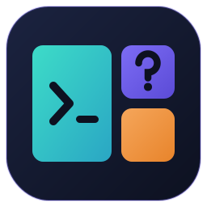

# 11 — omarchy-learn: your Omarchy & WSL2 tutor



`omarchy-learn` answers plain-English questions about Omarchy, Arch Linux and
running Omarchy on WSL2 — grounded in the docs and Omarchy source actually
installed on your machine.

```bash
oml "how do I list the packages I have installed"
```

```
pacman -Q

That lists every explicitly and dependency-installed package. Useful variations:

  pacman -Qe            packages you explicitly installed
  pacman -Qdt           orphaned dependencies
  pacman -Qi <package>  details for one package

This is the Arch equivalent of `apt list --installed`.
```

## What it is

A thin, opinionated wrapper around the **GitHub Copilot CLI**:

| Feature | Detail |
|---|---|
| **System prompt** | Makes it an Omarchy/WSL2 tutor with verified ground truth baked in |
| **Grounding** | Reads `/usr/share/omarchy-wsl2/docs` and `/usr/share/omarchy` before answering |
| **Model** | Defaults to `auto` — Copilot picks the cheapest suitable model |
| **Memory** | Remembers your preferences across questions |
| **Rendering** | Markdown via `glow`, falling back to `bat` then plain text |
| **Read-only** | `--deny-tool=shell --deny-tool=write` — it teaches, it never executes |

Because it grounds on `/usr/share/omarchy/bin/`, "what does `omarchy-update` do"
gets answered by *reading the actual script*, not by guessing.

## Requirements

- A **GitHub Copilot subscription**
- The **GitHub Copilot CLI** (`copilot`)
- `glow` for nice output (optional but recommended)

## Install

### Via the wizard (easiest)

```bash
./omarchy-wsl2
# choose: 4) Set up omarchy-learn
```

Or tick **omarchy-learn** in the developer-tools step of a fresh build.

### Via omarchy-wsl-devtools

Inside the distro:

```bash
sudo omarchy-wsl-devtools learn
copilot login
```

### Manual install

If you want it on a machine that wasn't built by this repo — including plain
Arch, or bare-metal Omarchy — install it by hand:

```bash
# 1. Dependencies
sudo pacman -S --needed glow nodejs npm

# 2. GitHub Copilot CLI
#    On x86_64 Omarchy the packaged build is available:
sudo pacman -S github-copilot-cli
#    Everywhere else (including aarch64), use npm:
npm config set prefix ~/.local
npm install -g @github/copilot
echo 'export PATH="$HOME/.local/bin:$PATH"' >> ~/.bashrc

# 3. Install omarchy-learn into /opt
sudo install -d -m 0755 /opt/omarchy-learn/bin /opt/omarchy-learn/share
sudo install -m 0755 overlay/opt/omarchy-learn/bin/omarchy-learn \
                     /opt/omarchy-learn/bin/omarchy-learn
sudo install -m 0644 overlay/opt/omarchy-learn/share/system-prompt.md \
                     /opt/omarchy-learn/share/system-prompt.md

# 4. Symlink it onto PATH (and the short 'oml' alias)
sudo ln -sfn /opt/omarchy-learn/bin/omarchy-learn /usr/local/bin/omarchy-learn
sudo ln -sfn /opt/omarchy-learn/bin/omarchy-learn /usr/local/bin/oml

# 5. Optional: let it ground answers in this project's docs
sudo install -d -m 0755 /usr/share/omarchy-wsl2/docs
sudo install -m 0644 docs/*.md /usr/share/omarchy-wsl2/docs/

# 6. Authenticate and verify
copilot login
omarchy-learn --check
```

> **Why `/opt` + `/usr/local/bin`?** `/opt` keeps the tool self-contained with
> its own `share/`, and `/usr/local/bin` is the FHS location for locally
> installed software. We deliberately avoid `/usr/bin`, which is pacman-owned
> on Arch — files placed there can collide during package upgrades.

## Usage

```bash
omarchy-learn "your question"     # ask
oml "your question"               # short alias
omarchy-learn                     # interactive mode
```

### Options

| Option | Purpose |
|---|---|
| `--check` | Verify Copilot CLI, auth, renderer, docs and memory |
| `--setup` | Install the Copilot CLI / glow and log in |
| `--topics` | Suggested starter questions |
| `--remember "fact"` | Store a preference for future answers |
| `--memories` | List stored preferences |
| `--forget [N\|all]` | Remove a preference |
| `--model <name>` | Override the model (default `auto`) |
| `--raw` | Print raw Markdown without glow |
| `--version` | Print the version |

### Interactive mode

```bash
$ oml
❯ how do I change the theme
❯ /remember I prefer fish over bash
❯ /model gpt-5.4
❯ /topics
❯ /quit
```

## Memory

Preferences are stored as plain Markdown at
`~/.config/omarchy-learn/memory.md` and injected into every prompt.

```bash
omarchy-learn --remember "I came from Ubuntu and like apt comparisons"
omarchy-learn --remember "I only use headless mode, no desktop"
omarchy-learn --remember "I prefer fish over bash"

omarchy-learn --memories
omarchy-learn --forget 2
omarchy-learn --forget all
```

Because it's a plain text file, you can edit it directly.

## Models and cost

The default is `auto`, which lets Copilot select the cheapest suitable model —
the right choice for short Q&A. Override per call or persistently:

```bash
omarchy-learn --model gpt-5.4 "explain Hyprland's dwindle layout in depth"
```

`--model` is saved to `~/.config/omarchy-learn/config`, so set it back with
`omarchy-learn --model auto`.

## Configuration

`~/.config/omarchy-learn/config`:

```bash
MODEL='auto'
RENDER='auto'     # auto | glow | raw
```

Environment override: `OML_MODEL=gpt-5.4 oml "..."`.

## Good questions to start with

```bash
oml --topics
```

```bash
# Packages
oml "how do I list the packages I have installed"
oml "what's the pacman equivalent of apt search"
oml "how do I install something from the AUR"

# Omarchy
oml "how do I change the theme"
oml "what are the essential Hyprland keybindings"
oml "what does omarchy-update actually do"

# WSL2
oml "why can't I run the full Hyprland desktop"
oml "how do I launch a GUI app from Omarchy"
oml "how do I back up my whole distro"

# Coming from Ubuntu
oml "I'm used to apt, what do I need to know"
oml "what is a rolling release and what typically breaks"
```

## Safety

`omarchy-learn` runs Copilot with `--deny-tool=shell` and `--deny-tool=write`.
It can **read** documentation to ground its answers, but it cannot run commands
or modify files. It shows you the command; you decide whether to run it.

## Troubleshooting

| Symptom | Fix |
|---|---|
| `Copilot CLI not installed` | `omarchy-learn --setup` |
| `Copilot returned no answer` | `copilot login`, then `omarchy-learn --check` |
| Output is unstyled plain text | `sudo pacman -S glow` |
| Answers ignore my setup | Check `--check` shows the grounding dirs exist |
| `oml: command not found` | Re-link: `sudo ln -sfn /opt/omarchy-learn/bin/omarchy-learn /usr/local/bin/oml` |

## Customising the system prompt

The prompt lives at `/opt/omarchy-learn/share/system-prompt.md`. Edit it to
change tone, add house rules, or teach it about your own setup:

```bash
sudoedit /opt/omarchy-learn/share/system-prompt.md
```

Rebuilding the image restores the shipped version, so keep local changes in
`--remember` memories where practical.
