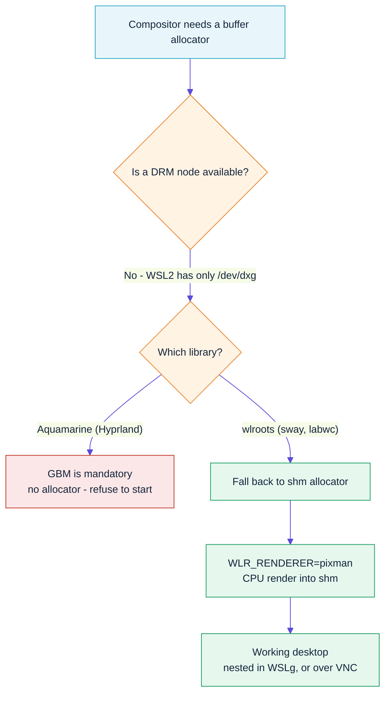

# 12 — Wayland on WSL2: why Hyprland can't run, and what does

> **Summary.** Hyprland cannot start under WSL2 — not nested, not headless,
> not with a virtual KMS device. Its backend library, Aquamarine,
> unconditionally requires a GBM allocator built from a DRM node, and WSL2
> exposes no DRM device at all. wlroots (sway, labwc) *can* run, because it
> falls back to a shared-memory allocator that needs no DRM node. That is why
> `omarchy-wsl-desktop` runs sway.

This document records the full investigation, because the failure modes are
misleading and the obvious workarounds all dead-end in the same place.

---

## 1. What WSL2 actually gives you

WSL2's graphics stack is **not** a normal Linux DRM stack:

| Device | Present? | Notes |
|---|---|---|
| `/dev/dxg` | ✅ | Direct3D12 paravirtualised GPU, driven via `libdxcore.so` |
| `/usr/lib/wsl/lib/libd3d12.so` | ✅ | Mesa's `d3d12` Gallium driver |
| `/dev/dri/cardN` | ❌ | No KMS device |
| `/dev/dri/renderD128` | ❌ | **No render node** |

Verify on any WSL2 distro:

```bash
ls -l /dev/dri /dev/dxg
```

On an aarch64 WSL2 VM (Snapdragon X, Adreno X1-85) this prints
`/dev/dri: No such file or directory` while `/dev/dxg` exists. GPU
acceleration in WSLg is real — `glxinfo -B` reports a D3D12 renderer — but it
is reached through dxcore, **not** through DRM.

That single fact is the root of everything below.

---

## 2. Hyprland's hard dependency

Hyprland ≥ 0.45 delegates all output handling to
[Aquamarine](https://github.com/hyprwm/aquamarine). Aquamarine builds its
allocator like this (`src/backend/Backend.cpp`):

```cpp
for (auto const& b : implementations) {
    if (b->drmFD() >= 0) {
        auto fd = reopenDRMNode(b->drmFD());
        ...
        primaryAllocator = CGBMAllocator::create(fd, self);
        break;
    }
}

if (!primaryAllocator && (implementations.empty() ||
                          implementations.at(0)->type() != AQ_BACKEND_NULL)) {
    log(AQ_LOG_CRITICAL, "Cannot open backend: no allocator available");
    return false;
}
```

There is **no non-GBM path**. Every backend must ultimately surrender a DRM
file descriptor, or the whole compositor refuses to start. Note also
`src/backend/Headless.cpp`:

```cpp
int Aquamarine::CHeadlessBackend::drmFD() {
    return -1;
}
```

The headless backend therefore *cannot* satisfy the allocator on its own — it
only works on machines where the DRM or Wayland backend also started.

### The misleading error

All of these failures surface as the same string, because Hyprland throws it
for both the null-backend and failed-start cases (`src/Compositor.cpp`):

```
Critical error thrown: CBackend::create() failed!
```

Do not trust it. The real reason is always in
`$XDG_RUNTIME_DIR/hypr/<sig>/hyprland.log`, and stdout logging is disabled
moments before the failure. To see it:

```bash
printf '\ndebug {\n  disable_logs = false\n  enable_stdout_logs = true\n}\n' \
  >> ~/.config/hypr/hyprland.conf
AQ_TRACE=1 Hyprland
```

---

## 3. The three backends, and how each one dies

### 3a. Wayland backend (nested inside WSLg) — missing protocols

WSLg's compositor is a Microsoft fork of Weston with an RDP backend. Its
complete advertised global list, captured with `AQ_TRACE=1`:

```
wl_compositor (v4)        wl_subcompositor          wp_viewporter
zxdg_output_manager_v1    wp_presentation           zwp_relative_pointer_manager_v1
zwp_pointer_constraints_v1 zwp_input_timestamps_manager_v1
wl_data_device_manager    wl_shm                    wl_output
zwp_input_panel_v1        zwp_text_input_manager_v1 xdg_wm_base (v1)
zxdg_shell_v6             wl_shell                  weston_rdprail_shell
weston_screenshooter      wl_seat (v7)              zwp_input_method_v1
```

**`zwp_linux_dmabuf_v1` is absent. So is `wl_drm`.** Aquamarine's Wayland
backend requires dmabuf, so it reports:

```
ERR from aquamarine ]: Wayland backend cannot start: Missing protocols
```

This is not a version negotiation problem — the protocol simply is not there.
WSLg only offers `wl_shm`.

### 3b. DRM backend — nothing to attach to

With no `/dev/dri`, `CDRMBackend::attempt()` has no GPU to scan. Even after
manufacturing one (§4) it first needs a seat:

```
ERR ]: [libseat] Could not connect to socket /run/seatd.sock: Permission denied
ERR ]: [libseat] No backend was able to open a seat
ERR ]: Failed to open a session
ERR ]: DRM Backend failed
```

That part *is* fixable — install `seatd`, create the `seat` group, add your
user, `systemctl enable --now seatd`.

### 3c. Headless backend — no allocator

`drmFD()` returns `-1`, so:

```
CRIT from aquamarine ]: Cannot open backend: no allocator available
```

---

## 4. The vkms experiment (and why it still fails)

The WSL2 kernel ships `vkms.ko` — the Virtual Kernel Mode Setting driver:

```bash
find /lib/modules -name 'vkms*'
# /lib/modules/6.18.33.2-microsoft-standard-WSL2/kernel/drivers/gpu/drm/vkms/vkms.ko
```

Loading it genuinely creates a DRM device:

```bash
sudo modprobe vkms
ls -l /dev/dri/          # crw-rw---- root video 226,0 card0
grep -H . /sys/class/drm/card0-*/status   # card0-Virtual-1: connected
```

With `vkms` + `seatd`, Hyprland gets **remarkably far**:

- ✅ libseat opens a seat, DRM backend attaches
- ✅ `Virtual-1` connector detected, **34 modes** from 640x480 to 4096x2160
- ✅ Atomic modesetting supported, 2 planes, 33 formats
- ✅ EGL/GLES 3.0 context created (with `GBM_ALWAYS_SOFTWARE=1`)
- ✅ Hyprland starts, wayvnc connects, virtual keyboard and pointer appear

And then it stops, permanently:

```
TRACE ]: GBM: Allocating a buffer: size [1920, 1080], format XR24, scanout: true
ERR   ]: GBM: Allocating with modifiers failed, falling back to modifier-less
ERR   ]: GBM: Failed to allocate a GBM buffer: bo null
ERR   ]: Swapchain: Failed acquiring a buffer
ERR   ]: Monitor Virtual-1 has NO FALLBACK MODES, and an INVALID one was requested
CRIT  ]: ASSERTION FAILED! cannot alloc a FB with negative / zero size! (attempted 0x0)
```

### Why it is unfixable from userspace

vkms provides **KMS but no render node**. That leaves mesa two options, and
both are dead ends:

| Mesa path | Selected by | Outcome |
|---|---|---|
| `vkms_dri.so` (kmsro) | default | kmsro pairs a display-only device with a *render node*. There isn't one → `eglInitialize: DRI2: failed to get compatible render device` |
| `kms_swrast` | `GBM_ALWAYS_SOFTWARE=1` | EGL initialises, but `gbm_dri.c` sets `dri->software = true`; software screens report no `DRM_PRIME_CAP_EXPORT`, so `gbm_bo_create` with `GBM_BO_USE_SCANOUT` returns `NULL` |

You cannot have both. Aquamarine needs a scanout-capable, dmabuf-exportable
GBM buffer, and no combination of vkms and software mesa can produce one.

---

## 5. Why wlroots succeeds where Aquamarine fails

wlroots picks its allocator very differently
(`render/allocator/allocator.c`):

```c
uint32_t gbm_caps = WLR_BUFFER_CAP_DMABUF;
if ((backend_caps & gbm_caps) && (renderer_caps & gbm_caps) && drm_fd >= 0) {
    /* gbm allocator - requires a DRM fd */
}

uint32_t shm_caps = WLR_BUFFER_CAP_SHM | WLR_BUFFER_CAP_DATA_PTR;
if ((backend_caps & shm_caps) && (renderer_caps & shm_caps)) {
    /* shm allocator - NO DRM fd required */
    if ((alloc = wlr_shm_allocator_create()) != NULL)
        return alloc;
}
```

The GBM branch is guarded by `drm_fd >= 0`; the shm branch has no such guard
and is reached before the DRM-dumb and udmabuf paths. Pair that with
`WLR_RENDERER=pixman` (CPU rendering into shm buffers) and the headless or
Wayland backend, and you have a compositor with **zero GPU or DRM
requirements**.

That is exactly what `omarchy-wsl-desktop` configures.



---

## 6. What this costs you

Getting a desktop at all means accepting four real trade-offs. None are
configuration mistakes; all are consequences of WSL2 having no DRM device.

### CPU rendering (the big one)

`WLR_RENDERER=pixman` renders every pixel on the CPU. There is no way around
this: GLES2 and Vulkan need a DRM render node to bind to, and WSL2 has none.
The D3D12 acceleration you see in `omarchy-wsl-doctor` is real, but it is only
reachable by **WSLg clients**, not by a compositor running inside the distro.

In practice:

| Workload | Experience |
|---|---|
| Terminals, editors, file manager | Fine - indistinguishable from native |
| Web browsing, scrolling | Usable; heavy pages feel soft |
| Video playback, WebGL, games | Poor. Use `omarchy-wsl-app mpv` instead |
| 4K / 1440p full screen | Noticeably heavier than 1080p |

The workaround for anything GPU-bound is to run it **outside** the session:
`omarchy-wsl-app chromium` goes straight to WSLg and gets D3D12.

### No Hyprland eye-candy

Animations, blur, rounded window corners, and the `hypr*` daemons (`hyprlock`,
`hypridle`, `hyprsunset`) are Hyprland features. sway implements none of them,
so the desktop is flat and instant rather than animated. The wallpaper, the
pill bar and the theme colours are doing the visual work instead.

### No Xwayland inside the session

WSLg owns `/tmp/.X11-unix` and every display slot in it, so sway's Xwayland
cannot claim one and we disable it. Every app shipped in the image is
Wayland-native, so this rarely matters - but a genuinely X11-only app must be
run through WSLg with `omarchy-wsl-app`, not from inside the desktop.

### Single output, and VNC latency

The headless backend gives one virtual output; there is no multi-monitor. Over
VNC you also pay a round-trip on every frame, which is why 1080p often feels
better than 1440p even though both are "working".

### What you keep

Everything above the compositor is untouched: the Omarchy CLI and themes,
Neovim, lazygit, btop, the whole app suite, waybar, notifications, the
launcher, and clipboard integration with Windows.

---

## 7. Summary table

| Approach | Furthest point reached | Blocker |
|---|---|---|
| Hyprland nested in WSLg | Connected to compositor, enumerated globals | No `zwp_linux_dmabuf_v1` |
| Hyprland headless | Backend constructed | `drmFD() == -1`, no allocator |
| Hyprland + vkms + seatd | Compositor running, 34 modes, wayvnc attached | `gbm_bo_create` → `NULL` for scanout buffers |
| Hyprland + vkms, default mesa | — | `DRI2: failed to get compatible render device` |
| **sway + pixman + shm** | **Working desktop** | **none** |

---

## 8. What would have to change upstream

Any *one* of these would make Hyprland viable on WSL2:

1. **Aquamarine grows an shm allocator**, as wlroots has, for headless and
   `wl_shm`-only Wayland backends.
2. **WSLg advertises `zwp_linux_dmabuf_v1`**, which would fix nested mode
   directly. WSLg's compositor currently offers only `wl_shm`; check the
   global list yourself with the `AQ_TRACE=1` command in §8 before assuming
   this is still true on your build.
3. **WSL2 exposes a DRM render node** for `/dev/dxg`. On some x86_64 hosts
   dxgkrnl does expose `/dev/dri/renderD128`; where it does, vkms for KMS plus
   that render node via `vkms_dri.so` (kmsro) is worth retesting — see
   [08-arm64.md](08-arm64.md).

Until then, `--compositor hyprland` exists only to demonstrate the failure
and to start working automatically if item 1 ever lands.

## 9. Reproducing this yourself

```bash
# The nested failure (WSLg protocol gap)
AQ_TRACE=1 Hyprland 2>&1 | grep -i "global\|missing protocols"

# The headless failure
WLR_BACKENDS=headless AQ_TRACE=1 Hyprland 2>&1 | grep -i allocator

# The vkms experiment
sudo modprobe vkms
sudo pacman -Sy --noconfirm --needed seatd
sudo groupadd -f seat && sudo usermod -aG seat,video,render "$USER"
sudo systemctl enable --now seatd
# log out and back in for the group change, then:
GBM_ALWAYS_SOFTWARE=1 AQ_NO_MODIFIERS=1 AQ_TRACE=1 Hyprland 2>&1 | grep -i gbm

# The one that works
omarchy-wsl-desktop            # nested
omarchy-wsl-desktop vnc        # over VNC
```

## References

- Aquamarine — <https://github.com/hyprwm/aquamarine>
  (`src/backend/Backend.cpp`, `src/backend/Headless.cpp`, `src/allocator/GBM.cpp`)
- wlroots — <https://gitlab.freedesktop.org/wlroots/wlroots>
  (`render/allocator/allocator.c`, `docs/env_vars.md`)
- mesa — <https://gitlab.freedesktop.org/mesa/mesa>
  (`src/gbm/backends/dri/gbm_dri.c`, `GBM_ALWAYS_SOFTWARE`)
- hyprwm/Hyprland#3479 — maintainer's answer on WSL support: *"no."*
- WSLg — <https://github.com/microsoft/wslg>
